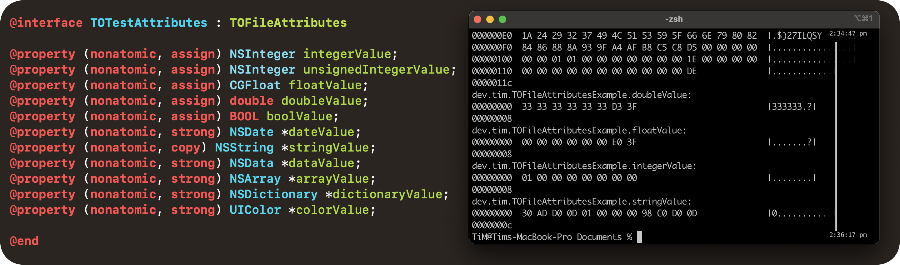

# TOFileAttributes


`TOFileAttributes` is an abstract class that can be extended to enable reading and writing custom data to a local file's [extended attributes](https://en.wikipedia.org/wiki/Extended_file_attributes). This allows quick and easy storage of transient information about a file (for example, the cursor position in a text file) in a non-destructive way that's invisible to the user.

The class is built upon the [`TOPropertyAccessor`](https://github.com/TimOliver/TOPropertyAccessor) library which provides a [Realm](https://github.com/realm/realm-cocoa)-like interface for defining custom model objects whose properties are mapped to an on-disk data store. This model makes it extremely easy and fast to set up new data schema, with all of the persistence logic handled under the hood.

## Features

* Properties defined in subclasses are directly mapped to attributes in a given file.
* Instances are cached by default for easier re-use.
* Properties are also cached internally in order to minimize the number of file reads and writes.
* Certain properties can be marked as "ignored" and will function as normal.

## Example

```objc
@interface FileAttributes : TOFileAttributes

@property (nonatomic, assign) NSInteger cursorPosition;

@end

// Fetch an instance of the class wrapped around a specific file.
FileAttributes *attributes = [FileAttributes attributesWithFileURL:URL];

// Save the current cursor position to disk
attributes.cursorPosition = 42;

```

## Requirements

* iOS 11.0 or higher
* Xcode 12.0 or higher

## Installation Instructions

<details>
<summary><b>Manual Installation</b></summary>
<br>
  
1. Download the repositories for [`TOFileAttributes`](https://github.com/TimOliver/TOFileAttributes/archive/refs/heads/main.zip) and [`TOPropertyAccessor`](https://github.com/TimOliver/TOPropertyAccessor/archive/refs/heads/main.zip).
2. Install the source files from the `TOFileAttributes` and `TOPropertyAccessor` folders.
  
</details>

<details>
<summary><b>CocoaPods</b></summary>
<br>
  
Add `pod 'TOFileAttributes'` to your `Podfile`.
  
</details>

## Credits

`TOFileAttributes` was written by [Tim Oliver](http://twitter.com/TimOliverAU) as a component of iComics 2.

## License

`TOFileAttributes` is licensed under the MIT license. Please check the [`LICENSE`](LICENSE) file for more information.
